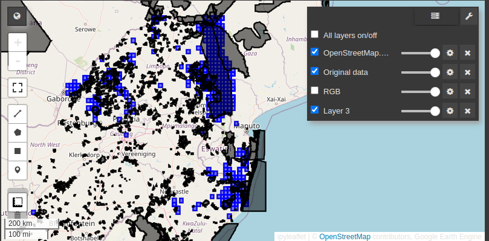

# Demo BioSpace25 Biodiversity Data Cubes

Welcome to my Google Colab notebook repository! This is a demonstration of the possibilities with biodiversity data cubes as they are developed in the B-Cubed project.

## 🚀 Features
- Generating data cubes with the GBIF SQL interface
- Interoperability of data cubes in Google Earth Engine

- Using GeoBON EBVs

## 📖 Notebook Preview
Click the link below to open the notebook in Google Colab:

## 📜 License
This project is licensed under the MIT License.

## Funding

B3 (Biodiversity Building Blocks for policy) receives funding from the European Union’s Horizon Europe Research and Innovation Programme (ID No 101059592). Views and opinions expressed are however those of the author(s) only and do not necessarily reflect those of the European Union or the European Commission. Neither the EU nor the EC can be held responsible for them.
